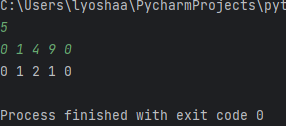
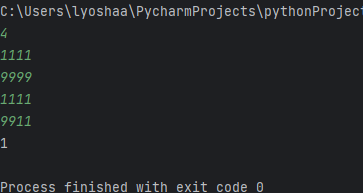
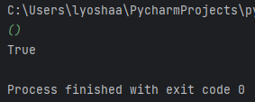
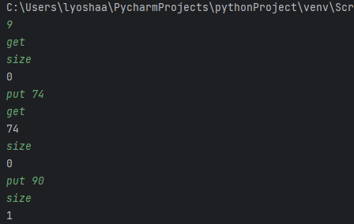
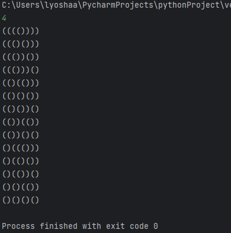
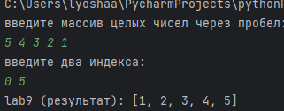

# lab4

## Задание
Тимофей ищет место, чтобы построить себе дом. Улица, на которой он хочет жить, имеет
длину n, то есть состоит из n одинаковых идущих подряд участков. Каждый участок либо
пустой, либо на нём уже построен дом.
Общительный Тимофей не хочет жить далеко от других людей на этой улице. Поэтому
ему важно для каждого участка знать расстояние до ближайшего пустого участка. Если участок
пустой, эта величина будет равна нулю — расстояние до самого себя.
Помогите Тимофею посчитать искомые расстояния. Для этого у вас есть карта улицы.
Дома в городе Тимофея нумеровались в том порядке, в котором строились, поэтому их номера
на карте никак не упорядочены. Пустые участки обозначены нулями.

## Проделанная работа
Реализован алгоритм двух проходов: слева направо и справа налево для определения расстояния до ближайшего нуля.

## Скриншоты

# lab5

## Задание
Определить, сколько баллов могут набрать два игрока, если они нажимают клавиши, указанные цифрами на поле 4x4.

## Проделанная работа
Подсчитано количество цифр и проверено, могут ли два игрока нажать нужное число клавиш одновременно.

## Скриншоты

# lab6

## Задание
Дана скобочная последовательность. Нужно определить ее правильость 

## Проделанная работа
использован стек для проверки корректного вложения и закрытия скобок

## Скриншоты

# lab7

## Задание
Реализуйте очередь с использованием связного списка. Очередь должна поддерживатьвыполнение трёх команд: put, get, size.

## Проделанная работа
Реализована очередь на односвязном списке, все операции выполняются за O(1).

## Скриншоты

# lab8

## Задание
Сгенерировать все правильные скобочные последовательности длины 2n в лексикографическом порядке

## Проделанная работа
Рекурсивно построены все посследовательности, отсортированные по лексикографическому порядку

## Скриншоты

# lab9

## Задание
Реализовать сортировку слиянием с отдельными функциями merge и merge_sort.

## Проделанная работа
Реализован алгоритм сортировки слиянием с использованием полуинтервалов.

## Скриншоты

